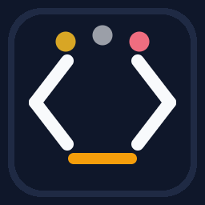

# CodeRooms

<p align="center">
  
</p>

Real-time collaborative coding inside VS Code — no screen sharing, just shared buffers, roles, and quick actions. CodeRooms pairs a lightweight Node.js WebSocket server with a VS Code extension so teams can create rooms, share documents, chat, and code together without leaving the editor.

> **See [INSTALLATION.md](INSTALLATION.md) for detailed setup instructions.**
>
> **See [RECOVERY.md](RECOVERY.md) for restart and persistence semantics.**
>
> **See [SECURITY.md](SECURITY.md) for the supported deployment model and security review notes.**

---

## Features

| Area | What you get |
|------|-------------|
| **Rooms & Roles** | Create or join rooms with `root`, `collaborator`, or `viewer` roles. Protect rooms with a secret (hashed with PBKDF2 on the server). |
| **Document Sharing** | Root shares any open file; collaborators see edits in real time via incremental patches with server-side OT (Operational Transform). |
| **Suggestion Mode** | Collaborator edits become inline suggestions the root can accept or reject — great for code reviews and teaching. |
| **Direct Edit Mode** | Toggle collaborators into direct edit mode when free-form collaboration is preferred. |
| **Encrypted Chat** | In-editor chat panel with end-to-end encryption (AES-256-GCM) when a room secret is provided. |
| **Follow Cursor** | Collaborators can follow the root's cursor across files in real time. |
| **Participants Panel** | Tree view showing who's in the room, their role, edit mode, and activity status. |
| **Invite Tokens** | Generate single-use invite tokens for secure room access. |
| **Room Export** | Root can export the entire room (all shared documents) as a `.zip` archive. |
| **Persistence** | Server persists room state with atomic JSON backups and auto-restores on restart. |
| **Rate Limiting** | Per-IP connection, room, join-attempt, chat, and suggestion rate limits server-side. |

---

## Quick Start

```bash
# 1. Clone and install
git clone https://github.com/mobta/CodeRooms.git
cd CodeRooms
npm install

# 2. Build and start the server
npm run server:build
npm run server:start

# 3. Launch the extension
# Open the repo in VS Code → press F5 → "Run Extension"
```

In the Extension Development Host, run **CodeRooms: Start Room as Root** from the Command Palette.

> Full setup details, TLS configuration, and packaging instructions are in **[INSTALLATION.md](INSTALLATION.md)**.

---

## Extension Settings

| Setting | Type | Default | Description |
|---------|------|---------|-------------|
| `coderooms.serverUrl` | `string` | `ws://localhost:5171` | WebSocket URL for the coordination server. |
| `coderooms.mode` | `enum` | `team` | Default room mode (`team` or `classroom`). |
| `coderooms.debugLogging` | `boolean` | `false` | Enable verbose logging in the developer console. |

---

## Commands

| Command | Description | Who |
|---------|-------------|-----|
| Start Room as Root | Create a new room as the owner | Anyone |
| Join Room | Join an existing room by ID | Anyone |
| Leave Room | Leave the current room | Anyone |
| Copy Room ID | Copy the current room ID to clipboard | Anyone |
| Reconnect | Force reconnect to the server | Anyone |
| Share Current File | Share the active editor document | Root |
| Stop Sharing Current File | Unshare the active document | Root |
| Open Shared Document | Switch to a shared document | Anyone in room |
| Export Room | Download all shared docs as a zip | Root |
| Stop Room | Close the room for everyone | Root |
| Toggle Collaborator Mode | Switch between direct edit and suggestion mode | Collaborator |
| Toggle Follow Root | Follow or unfollow the root's cursor | Collaborator/Viewer |
| Change Participant Role | Change a participant's role | Root |
| Set Role → Root / Collaborator / Viewer | Quick role assignment from context menu | Root |
| Remove Participant | Kick a participant from the room | Root |
| Accept / Reject Suggestion | Act on a pending suggestion | Root |
| Generate Invite Token | Create a single-use join token | Root |
| Open Chat / Send Chat Message | Chat with room participants | Anyone in room |

---

## Server Configuration

The server accepts configuration through CLI flags, environment variables, or a `coderooms.config.json` file:

| Option | CLI Flag | Env Variable | Default |
|--------|----------|-------------|---------|
| Port | `--port`, `-p` | `CODEROOMS_PORT` | `5171` |
| Host | `--host`, `-h` | `CODEROOMS_HOST` | `127.0.0.1` |
| TLS Cert | `--cert` | `CODEROOMS_CERT` | *(none)* |
| TLS Key | `--key` | `CODEROOMS_KEY` | *(none)* |

Resolution order: CLI → environment variable → config file → default.

---

## Security

- Room secrets hashed with **PBKDF2** (100 000 iterations, SHA-512).
- Chat is **E2E encrypted** (AES-256-GCM) when a room secret is set; document content is transmitted in plaintext.
- Per-IP limits: max 20 connections, 10 rooms, rate-limited joins/chat/suggestions.
- Display names capped at 50 characters; message payloads capped at 512 KB.
- No built-in TLS — run behind a reverse proxy (nginx, Caddy) for production use.
- Room state persisted via atomic JSON backups; auto-restored on restart.
- Restart behavior and recoverable-state boundaries are documented in [RECOVERY.md](RECOVERY.md).

---

## Project Structure

```
CodeRooms/
├── src/                    # Extension source (TypeScript)
│   ├── extension.ts        # Activation, commands, message handling
│   ├── connection/         # WebSocket client + message types
│   ├── core/               # DocumentSync, RoomState, ChatManager, etc.
│   ├── ui/                 # ChatView, ParticipantsView, StatusBar
│   └── util/               # Config, logger, crypto helpers
├── server/                 # Coordination server (TypeScript)
│   ├── server.ts           # WebSocket server, room logic, persistence
│   ├── patch.ts            # Text patch application
│   ├── ot.ts               # Operational Transform engine
│   ├── rateLimiter.ts      # Token-bucket rate limiter
│   └── types.ts            # Re-exports shared protocol types
├── shared/                 # Shared type definitions
│   └── protocol.ts         # Single source of truth for message types
├── tests/                  # Vitest test suite
├── media/                  # Icons and assets
├── out/                    # Compiled extension output
└── out-server/             # Compiled server output
```

---

## Development

```bash
npm run compile          # Compile the extension
npm run typecheck        # Type-check without emitting
npm run bundle           # Bundle with esbuild for packaging
npm run server:build     # Compile the server
npm test                 # Run all tests (vitest)
npm run package          # Package as .vsix
```

---

## License

[MIT](LICENSE)
